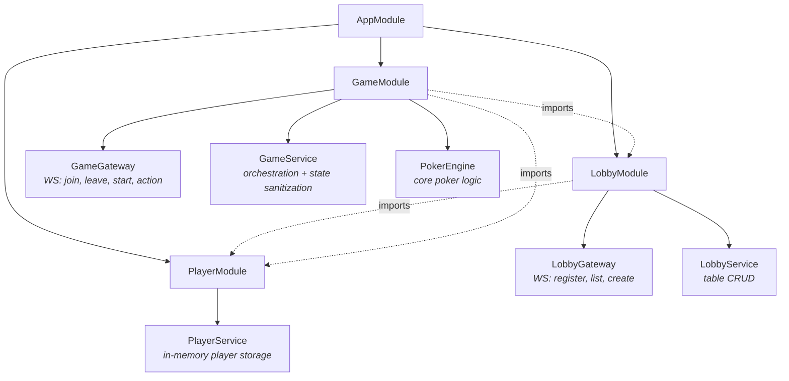
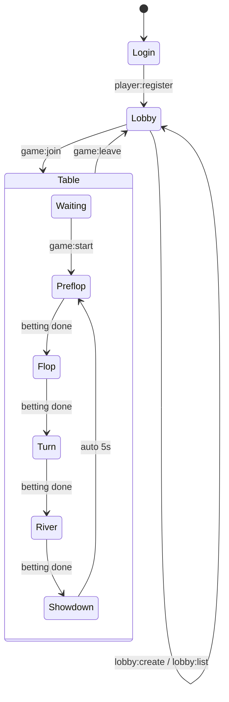
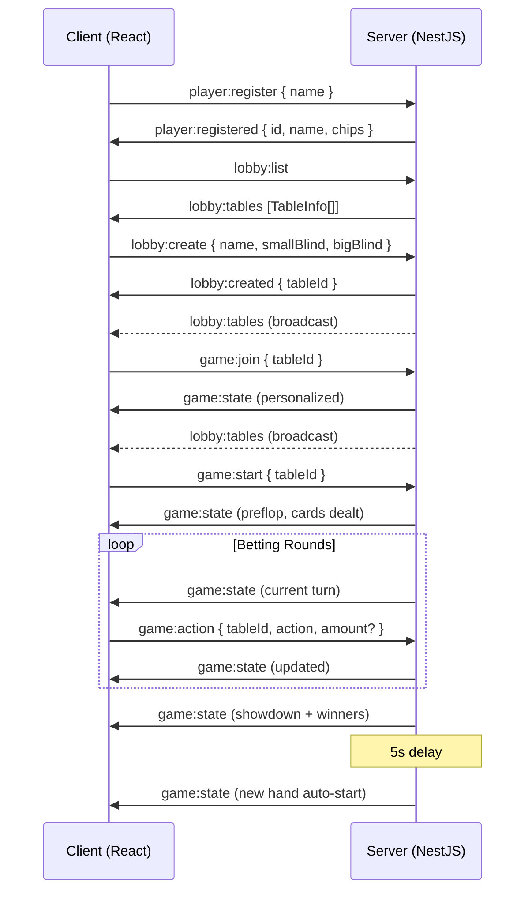
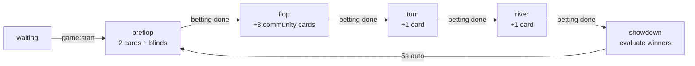
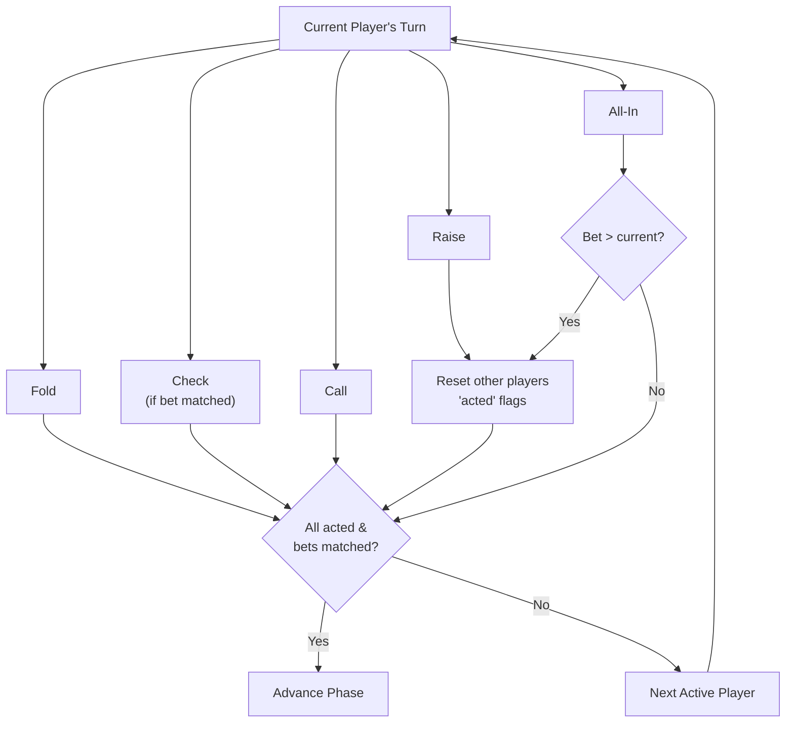

# Poker Room — PoC

Real-time multiplayer Texas Hold'em poker room with lobby system.

**Stack**: NestJS + Socket.IO (backend) | React + Vite (frontend)

---

## Quick Start

```bash
# 1. Install dependencies (from root)
npm install

# 2. Start backend (terminal 1)
cd backend && npm run start:dev

# 3. Start frontend (terminal 2)
cd frontend && npm run dev
```

- Backend: `http://localhost:3005`
- Frontend: `http://localhost:5173`

Open 2+ browser tabs, register with different names, create a table, and play.

---

## Architecture

### Project Structure

```
poker-room/
├── backend/                    # NestJS application
│   ├── src/
│   │   ├── main.ts             # Entry point (port 3005)
│   │   ├── app.module.ts       # Root module
│   │   ├── player/
│   │   │   ├── player.module.ts
│   │   │   └── player.service.ts    # In-memory player registry
│   │   ├── lobby/
│   │   │   ├── lobby.module.ts
│   │   │   ├── lobby.service.ts     # Table management
│   │   │   └── lobby.gateway.ts     # WebSocket: register, list, create
│   │   └── game/
│   │       ├── game.module.ts
│   │       ├── game.service.ts      # Game orchestration
│   │       ├── game.gateway.ts      # WebSocket: join, leave, action
│   │       └── poker-engine.ts      # Texas Hold'em engine
│   ├── package.json
│   └── tsconfig.json
├── frontend/                   # React + Vite application
│   ├── src/
│   │   ├── main.tsx            # Entry point
│   │   ├── App.tsx             # Root component, screen routing
│   │   ├── types.ts            # Shared TypeScript types
│   │   ├── index.css           # Global styles
│   │   ├── hooks/
│   │   │   └── useSocket.ts    # Socket.IO connection hook
│   │   └── components/
│   │       ├── Login.tsx       # Player name input
│   │       ├── Lobby.tsx       # Table list & creation
│   │       ├── Table.tsx       # Game UI: cards, actions, pot
│   │       └── CardView.tsx    # Single card renderer
│   ├── index.html
│   ├── vite.config.ts
│   └── package.json
└── package.json                # npm workspaces root
```

### NestJS Module Dependency Graph



### Frontend Screen Flow



### Client-Server Communication



---

## WebSocket Protocol

All communication uses Socket.IO over WebSocket transport.

### Player Events

| Event | Direction | Payload | Description |
|---|---|---|---|
| `player:register` | Client → Server | `{ name }` | Register player (1000 starting chips) |
| `player:registered` | Server → Client | `{ id, name, chips }` | Registration confirmed |

### Lobby Events

| Event | Direction | Payload | Description |
|---|---|---|---|
| `lobby:list` | Client → Server | — | Request table list |
| `lobby:tables` | Server → All | `TableInfo[]` | Updated table list |
| `lobby:create` | Client → Server | `{ name?, smallBlind?, bigBlind? }` | Create new table |
| `lobby:created` | Server → Client | `{ tableId }` | Table created, ready to join |

### Game Events

| Event | Direction | Payload | Description |
|---|---|---|---|
| `game:join` | Client → Server | `{ tableId }` | Join a table |
| `game:leave` | Client → Server | `{ tableId }` | Leave a table |
| `game:start` | Client → Server | `{ tableId }` | Start hand (min 2 players) |
| `game:action` | Client → Server | `{ tableId, action, amount? }` | Player action |
| `game:state` | Server → Client | `GameState` | Personalized game state update |
| `error` | Server → Client | `{ message }` | Error notification |

**Actions**: `fold` | `check` | `call` | `raise` | `all-in`

---

## Game Flow

### Texas Hold'em Phases



### Betting Round Logic



### Hand Rankings (best 5 of 7 cards)

| Rank | Hand | Score |
|---:|---|---|
| 1 | Royal Flush | 9×10¹⁰ |
| 2 | Straight Flush | 8×10¹⁰ |
| 3 | Four of a Kind | 7×10¹⁰ |
| 4 | Full House | 6×10¹⁰ |
| 5 | Flush | 5×10¹⁰ |
| 6 | Straight | 4×10¹⁰ |
| 7 | Three of a Kind | 3×10¹⁰ |
| 8 | Two Pair | 2×10¹⁰ |
| 9 | One Pair | 1×10¹⁰ |
| 10 | High Card | kickers |

---

## Key Data Types

### GameState (server → client)

```typescript
{
  tableId: string
  phase: 'waiting' | 'preflop' | 'flop' | 'turn' | 'river' | 'showdown'
  communityCards: Card[]       // 0–5 cards
  pot: number
  players: PlayerSeat[]
  currentPlayerIndex: number
  dealerIndex: number
  smallBlind: number
  bigBlind: number
  currentBet: number
  winners?: { playerId, amount, hand }[]
}
```

### PlayerSeat

```typescript
{
  playerId: string
  name: string
  chips: number
  cards: Card[]     // hidden for opponents (empty array)
  bet: number       // current round bet
  totalBet: number  // total hand bet
  folded: boolean
  allIn: boolean
}
```

### Card

```typescript
{
  rank: '2'–'10' | 'J' | 'Q' | 'K' | 'A'
  suit: 'hearts' | 'diamonds' | 'clubs' | 'spades'
}
```

---

## Design Decisions

- **In-memory storage** — all state lives in memory, resets on restart (PoC scope)
- **Personalized state** — each player receives `game:state` with only their own cards visible (opponents' cards = `[]`), except during showdown
- **Socket.IO rooms** — players at same table share a room (`tableId`) for efficient broadcasting
- **Auto-restart** — new hand starts automatically 5 seconds after showdown if 2+ players have chips
- **Table cleanup** — empty tables are automatically deleted when last player disconnects
- **Max 6 players per table** — configurable in lobby service
- **Starting stack** — 1000 chips per player
