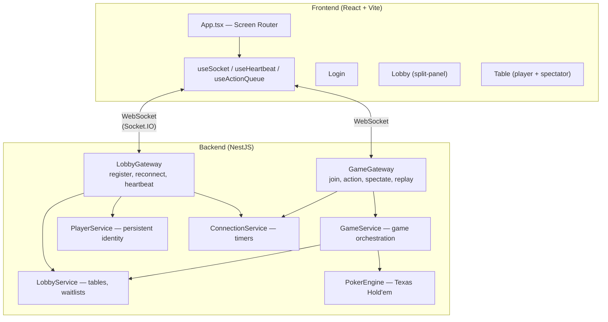
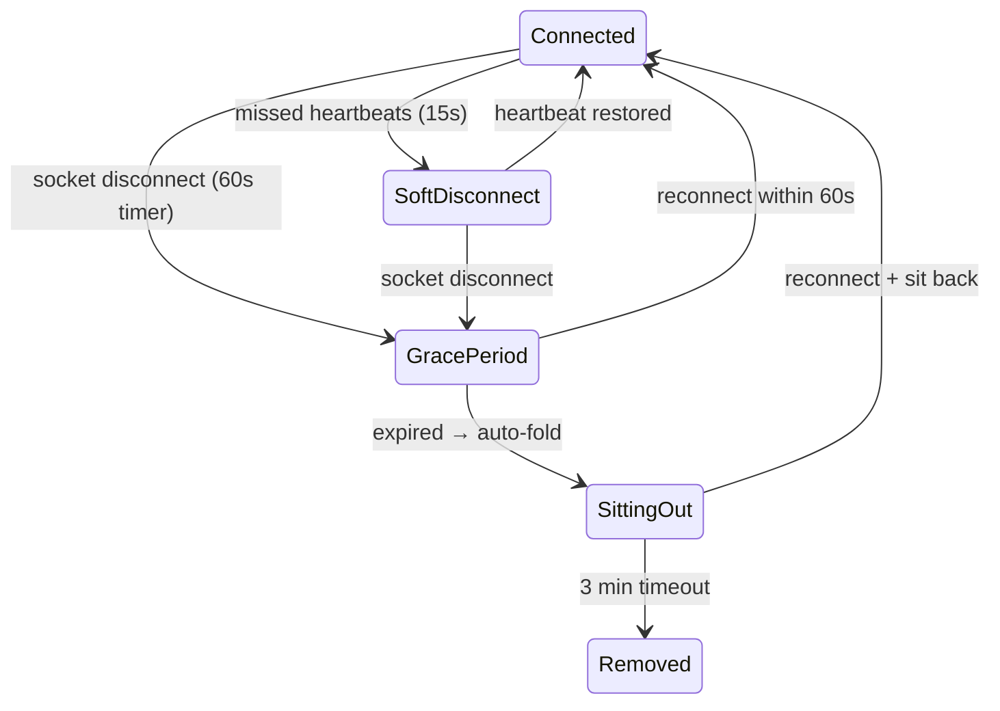

# Poker Room

Real-time multiplayer Texas Hold'em poker room with production-grade connection resilience.

**Stack**: NestJS + Socket.IO | React + Vite | TypeScript

## Features

- Texas Hold'em engine with full hand evaluation (Royal Flush → High Card)
- Real-time multiplayer via WebSocket (Socket.IO)
- Split-panel lobby with live table preview, filtering & sorting
- Spectator mode (watch games without playing)
- Waitlist system (auto-seat when spot opens)
- **Production-grade reconnection**: persistent identity, 60s grace period, auto-fold/sit-out
- **Custom heartbeat**: connection quality monitoring (stable/unstable/disconnected)
- **Action replay queue**: offline action buffering with server-side validation on reconnect
- Turn timers with auto-actions (30s normal, 15s disconnected)

## Quick Start

```bash
npm install                    # Install all dependencies

# Terminal 1
cd backend && npm run start:dev   # Backend → http://localhost:3005

# Terminal 2
cd frontend && npm run dev        # Frontend → http://localhost:5173
```

Open 2+ browser tabs, register, create a table, and play.

## Architecture



## Connection Resilience



- **Heartbeat**: client pings every 5s, server tracks quality
- **Grace period**: 60s to reconnect, seat reserved
- **Auto-actions**: disconnected player's turn → auto-fold/check after 15s
- **Action replay**: actions sent offline are buffered and replayed on reconnect
- **Sitting out**: auto sit-out after grace period, 3 min before removal

## Documentation

| Document | Description |
|---|---|
| [Getting Started](docs/01-getting-started.md) | Installation, running, scripts, tech stack |
| [Architecture](docs/02-architecture.md) | Project structure, module graph, component tree, data flow |
| [WebSocket Protocol](docs/03-websocket-protocol.md) | All events, payloads, rooms, visibility rules |
| [Connection Resilience](docs/04-connection-resilience.md) | Heartbeat, reconnect, grace period, replay queue, sit-out |
| [Game Engine](docs/05-game-engine.md) | Phases, betting logic, hand evaluation, pot management |
| [Lobby & Spectators](docs/06-lobby-and-spectators.md) | Split-panel lobby, preview, spectator mode, waitlist |
| [Frontend Guide](docs/07-frontend-guide.md) | Screens, hooks, components, connection state UI |
| [Data Types](docs/08-data-types.md) | All interfaces, types, constants reference |

## WebSocket Events (Summary)

| Category | Events |
|---|---|
| **Player** | `player:register`, `player:reconnect`, `heartbeat` |
| **Lobby** | `lobby:list`, `lobby:create`, `lobby:tables` |
| **Game** | `game:join`, `game:leave`, `game:start`, `game:action` |
| **Replay** | `game:action:replay`, `game:action:ack` |
| **Spectator** | `game:spectate`, `game:preview`, `game:preview:state` |
| **Sit-out** | `game:sitout`, `game:sitback` |
| **Waitlist** | `game:waitlist:join`, `game:waitlist:leave`, `game:waitlist:promoted` |

Full protocol: [docs/03-websocket-protocol.md](docs/03-websocket-protocol.md)

## Design Decisions

- **In-memory storage** — all state resets on restart (PoC scope)
- **Persistent userId** — UUID in localStorage survives reconnects
- **Personalized state** — each player sees only their own cards (except showdown)
- **Spectator view** — all cards hidden, shared between spectators and lobby preview
- **Socket.IO rooms** — per-table rooms for efficient broadcasting
- **forwardRef modules** — resolves NestJS circular dependency between Lobby and Game modules
