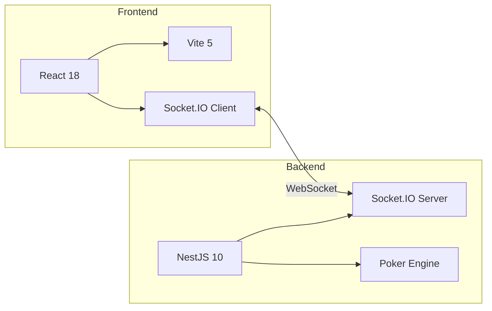

# Getting Started

## Prerequisites

- **Node.js** >= 18.x
- **npm** >= 9.x

## Installation

```bash
# Clone the repository
git clone <repo-url>
cd poker-room

# Install all dependencies (workspaces: backend + frontend)
npm install
```

## Running the Application

You need two terminals — one for backend, one for frontend.

### Terminal 1: Backend

```bash
cd backend
npm run start:dev
```

Backend starts at `http://localhost:3005` with hot-reload.

### Terminal 2: Frontend

```bash
cd frontend
npm run dev
```

Frontend starts at `http://localhost:5173`.

## Quick Test

1. Open `http://localhost:5173` in **2 or more browser tabs**
2. Enter different player names in each tab
3. In one tab: click **+ Create Table** → set blinds → **Create & Join**
4. In the other tab: click the table in the list → click **Join Table**
5. Once 2+ players are seated → click **Start Game**
6. Play poker!

## Project Scripts

### Root (`package.json`)

| Script | Description |
|---|---|
| `npm run dev:backend` | Start backend in dev mode |
| `npm run dev:frontend` | Start frontend in dev mode |

### Backend (`backend/package.json`)

| Script | Description |
|---|---|
| `npm run start:dev` | Start with hot-reload (watch mode) |
| `npm run build` | Compile TypeScript → `dist/` |
| `npm run start` | Start compiled (no watch) |
| `npm run start:prod` | Start production build |

### Frontend (`frontend/package.json`)

| Script | Description |
|---|---|
| `npm run dev` | Vite dev server with HMR |
| `npm run build` | TypeScript check + Vite production build |
| `npm run preview` | Preview production build locally |

## Environment

| Service | URL | Port |
|---|---|---|
| Backend (NestJS + Socket.IO) | `http://localhost:3005` | 3005 |
| Frontend (React + Vite) | `http://localhost:5173` | 5173 |

## Tech Stack


