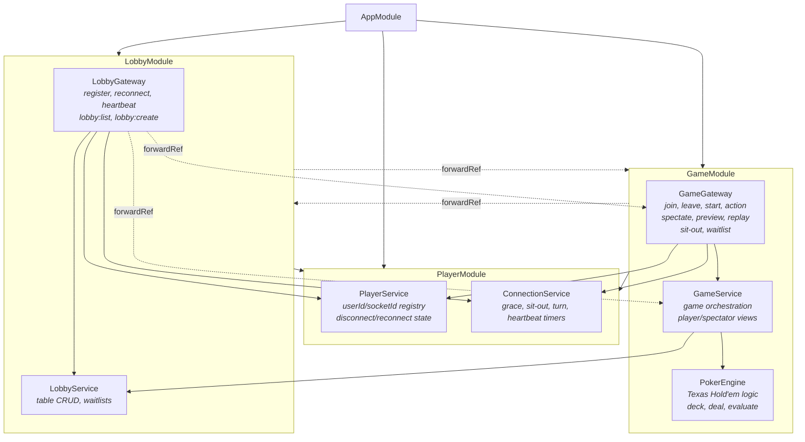
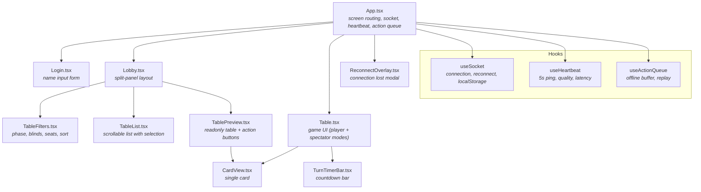
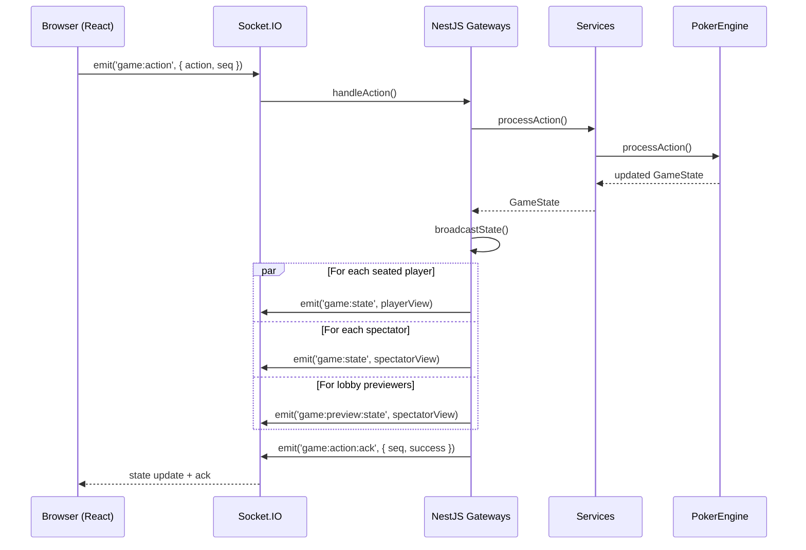

# Architecture

## Project Structure

```
poker-room/
├── backend/                         # NestJS application
│   ├── src/
│   │   ├── main.ts                  # Bootstrap, port 3005, CORS
│   │   ├── app.module.ts            # Root module
│   │   ├── player/
│   │   │   ├── player.module.ts     # Exports PlayerService, ConnectionService
│   │   │   ├── player.service.ts    # Persistent player registry (userId/socketId)
│   │   │   └── connection.service.ts # Timers: grace, sit-out, turn, heartbeat
│   │   ├── lobby/
│   │   │   ├── lobby.module.ts      # Imports PlayerModule, GameModule (forwardRef)
│   │   │   ├── lobby.service.ts     # Table CRUD, waitlists
│   │   │   └── lobby.gateway.ts     # WS: register, reconnect, heartbeat, lobby
│   │   └── game/
│   │       ├── game.module.ts       # Imports LobbyModule (forwardRef), PlayerModule
│   │       ├── game.service.ts      # Game orchestration, state views
│   │       ├── game.gateway.ts      # WS: join, leave, action, spectate, replay
│   │       └── poker-engine.ts      # Texas Hold'em: deck, deal, evaluate, phases
│   ├── nest-cli.json
│   ├── tsconfig.json
│   └── package.json
├── frontend/                        # React + Vite application
│   ├── src/
│   │   ├── main.tsx                 # ReactDOM entry
│   │   ├── App.tsx                  # Root: screens, socket, heartbeat, action queue
│   │   ├── types.ts                 # Shared TypeScript interfaces
│   │   ├── index.css                # Tailwind CSS + Obsidian Lounge @theme tokens
│   │   ├── hooks/
│   │   │   ├── useSocket.ts         # Socket.IO connection + auto-reconnect (sessionStorage)
│   │   │   ├── useHeartbeat.ts      # Custom heartbeat (5s interval, quality, latency)
│   │   │   └── useActionQueue.ts    # Offline action buffer + replay on reconnect
│   │   └── components/
│   │       ├── ui/
│   │       │   ├── Layout.tsx       # App shell: header + sidebar + content
│   │       │   ├── Header.tsx       # Top nav: logo, wallet, quality indicator
│   │       │   └── Sidebar.tsx      # Left nav + mobile bottom nav
│   │       ├── Login.tsx            # "Enter the Lounge" — name input
│   │       ├── Lobby.tsx            # Table cards grid + preview panel
│   │       ├── TableFilters.tsx     # Phase tabs, blinds range, sort controls
│   │       ├── TableList.tsx        # Card grid with badges, metrics, avatars
│   │       ├── TablePreview.tsx     # Glass panel: live preview + Join/Watch
│   │       ├── Table.tsx            # Oval poker table, absolute seats, action bar
│   │       ├── CardView.tsx         # 3 sizes, inverse-surface bg, suit colors
│   │       ├── TurnTimerBar.tsx     # Thin animated bar (primary→secondary→error)
│   │       └── ReconnectOverlay.tsx # Glass panel + backdrop-blur overlay
│   ├── index.html                   # Google Fonts (Manrope, Space Grotesk, Material Symbols)
│   ├── postcss.config.js
│   ├── vite.config.ts               # React + Tailwind CSS v4 plugin
│   ├── tsconfig.json
│   └── package.json
├── design/                          # Design mockups (HTML + screenshots)
│   ├── lobby/                       # Lobby screen mockup
│   ├── game_table/                  # Game table mockup
│   ├── cashier/                     # Cashier screen mockup
│   ├── player_profile/              # Profile dashboard mockup
│   └── royal_felt_steel/DESIGN.md   # "The Obsidian Lounge" design system spec
├── docs/                            # Documentation
├── package.json                     # npm workspaces root
└── .gitignore
```

## NestJS Module Graph



## Frontend Component Tree



## Data Flow



## State Storage

All state is **in-memory** (no database). Server restart clears everything.

| Store | Location | Key | Value |
|---|---|---|---|
| Players | `PlayerService.bySocket` | socketId | Player |
| Players | `PlayerService.byUserId` | userId (UUID) | Player |
| Tables | `LobbyService.tables` | tableId | GameState |
| Table names | `LobbyService.tableNames` | tableId | string |
| Waitlists | `LobbyService.waitlists` | tableId | userId[] |
| Spectators | `GameGateway.spectators` | tableId | Set\<socketId\> |
| Previewers | `GameGateway.previewers` | tableId | Set\<socketId\> |
| Action seqs | `GameGateway.actionSeq` | tableId | number |
| Grace timers | `ConnectionService.graceTimers` | userId | Timer |
| Sit-out timers | `ConnectionService.sitOutTimers` | userId | Timer |
| Action timers | `ConnectionService.actionTimers` | tableId | Timer |
| Heartbeats | `ConnectionService.heartbeats` | socketId | HeartbeatState |
