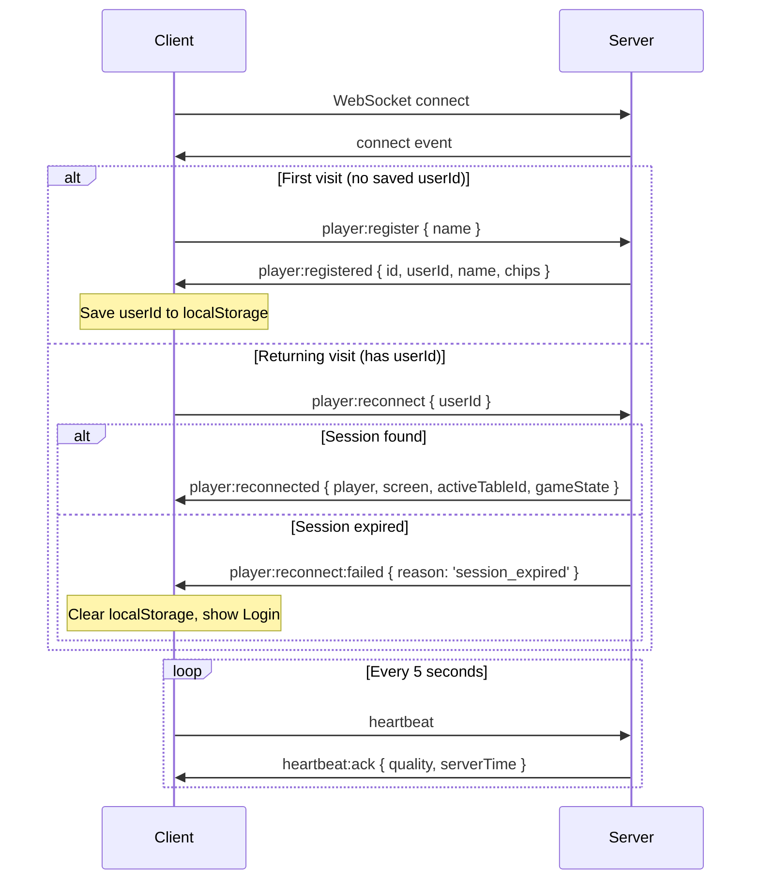
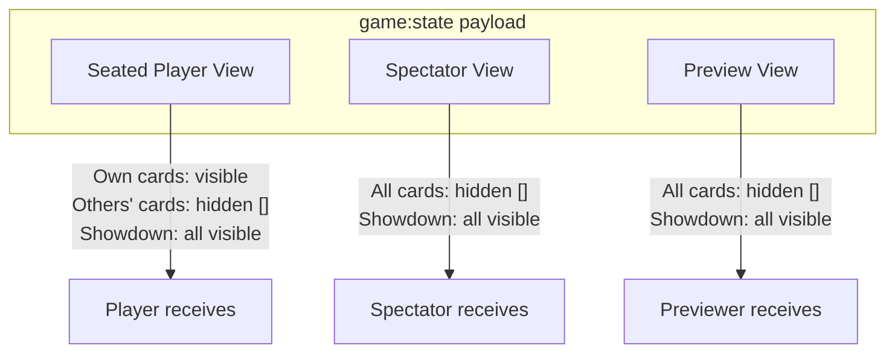

# WebSocket Protocol

All communication uses **Socket.IO** over WebSocket transport (`transports: ['websocket']`).

## Connection Lifecycle

## Events Reference

### Player Events

| Event | Direction | Payload | Description |
|---|---|---|---|
| `player:register` | C → S | `{ name: string }` | Register new player (1000 chips) |
| `player:registered` | S → C | `{ id, userId, name, chips }` | Registration confirmed |
| `player:reconnect` | C → S | `{ userId: string }` | Reconnect with saved session |
| `player:reconnected` | S → C | `{ player, screen, activeTableId, gameState }` | Full state snapshot |
| `player:reconnect:failed` | S → C | `{ reason: string }` | Must re-register |

### Heartbeat Events

| Event | Direction | Payload | Description |
|---|---|---|---|
| `heartbeat` | C → S | — | Client ping (every 5s) |
| `heartbeat:ack` | S → C | `{ quality, serverTime }` | Quality: `stable` / `unstable` / `disconnected` |

### Lobby Events

| Event | Direction | Payload | Description |
|---|---|---|---|
| `lobby:list` | C → S | — | Request table list |
| `lobby:tables` | S → All | `TableInfo[]` | Updated table list (broadcast) |
| `lobby:create` | C → S | `{ name?, smallBlind?, bigBlind? }` | Create new table |
| `lobby:created` | S → C | `{ tableId }` | Table created |

### Game Events

| Event | Direction | Payload | Description |
|---|---|---|---|
| `game:join` | C → S | `{ tableId }` | Join table as player |
| `game:leave` | C → S | `{ tableId }` | Leave table |
| `game:start` | C → S | `{ tableId }` | Start hand (min 2 active) |
| `game:action` | C → S | `{ tableId, action, amount?, seq? }` | Player action |
| `game:action:ack` | S → C | `{ seq, serverSeq, success, reason? }` | Action confirmation |
| `game:state` | S → C | `GameState` | Personalized state update |
| `error` | S → C | `{ message }` | Error notification |

**Action types**: `fold` | `check` | `call` | `raise` | `all-in`

### Action Replay Events

| Event | Direction | Payload | Description |
|---|---|---|---|
| `game:action:replay` | C → S | `{ tableId, actions[] }` | Replay buffered actions |
| `game:action:replay:result` | S → C | `{ results[] }` | Per-action success/failure |

Each action in replay: `{ action, amount?, seq, timestamp }`
Each result: `{ seq, success, reason? }`

Reasons: `expired` (>60s old), `invalid_action`, `skipped_after_failure`

### Spectator & Preview Events

| Event | Direction | Payload | Description |
|---|---|---|---|
| `game:spectate` | C → S | `{ tableId }` | Watch as spectator (full screen) |
| `game:unspectate` | C → S | `{ tableId }` | Stop spectating |
| `game:preview` | C → S | `{ tableId }` | Subscribe to preview in lobby |
| `game:unpreview` | C → S | `{ tableId }` | Unsubscribe from preview |
| `game:preview:state` | S → C | `GameState` | Preview state (spectator view) |

### Sit-Out Events

| Event | Direction | Payload | Description |
|---|---|---|---|
| `game:sitout` | C → S | `{ tableId }` | Voluntarily sit out |
| `game:sitback` | C → S | `{ tableId }` | Return from sit-out |

### Waitlist Events

| Event | Direction | Payload | Description |
|---|---|---|---|
| `game:waitlist:join` | C → S | `{ tableId }` | Join waitlist |
| `game:waitlist:leave` | C → S | `{ tableId }` | Leave waitlist |
| `game:waitlist:status` | S → C | `{ position, total }` | Position in queue |
| `game:waitlist:promoted` | S → C | `{ tableId }` | Auto-seated from waitlist |

## State Visibility Rules

| Field | Player (own) | Player (others) | Spectator | Preview |
|---|---|---|---|---|
| `cards` | Visible | `[]` | `[]` | `[]` |
| `cards` (showdown) | Visible | Visible | Visible | Visible |
| `chips` | Visible | Visible | Visible | Visible |
| `bet` | Visible | Visible | Visible | Visible |
| `folded` | Visible | Visible | Visible | Visible |
| `disconnected` | Visible | Visible | Visible | Visible |
| `sittingOut` | Visible | Visible | Visible | Visible |

## Socket.IO Rooms

| Room | Members | Purpose |
|---|---|---|
| `{tableId}` | Seated players + spectators | `game:state` broadcasts |
| `preview:{tableId}` | Lobby previewers | `game:preview:state` broadcasts |
| `{socketId}` | Individual socket | Personalized player views |
