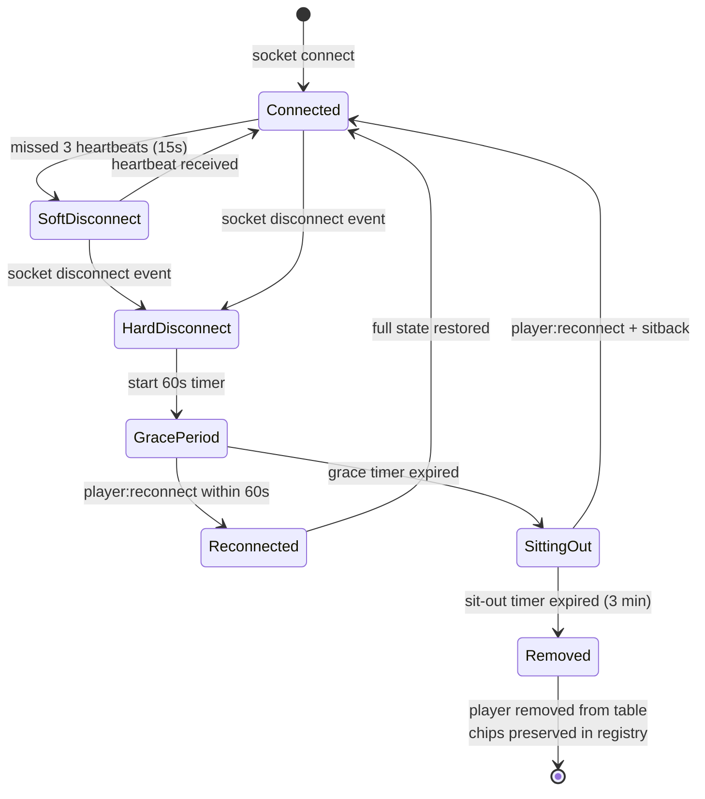
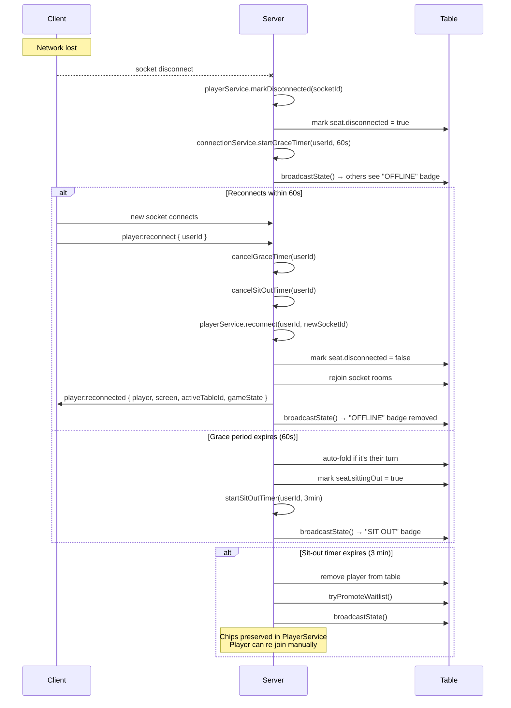
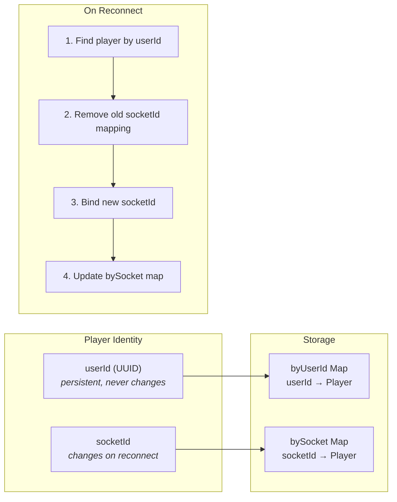
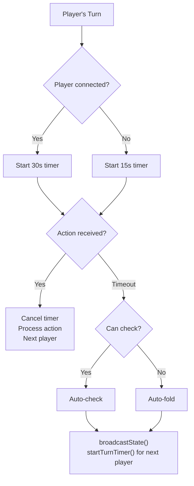
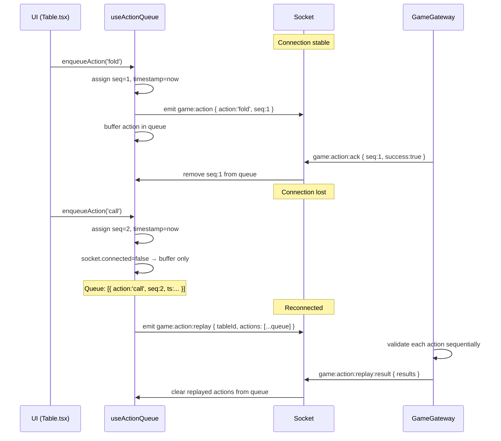
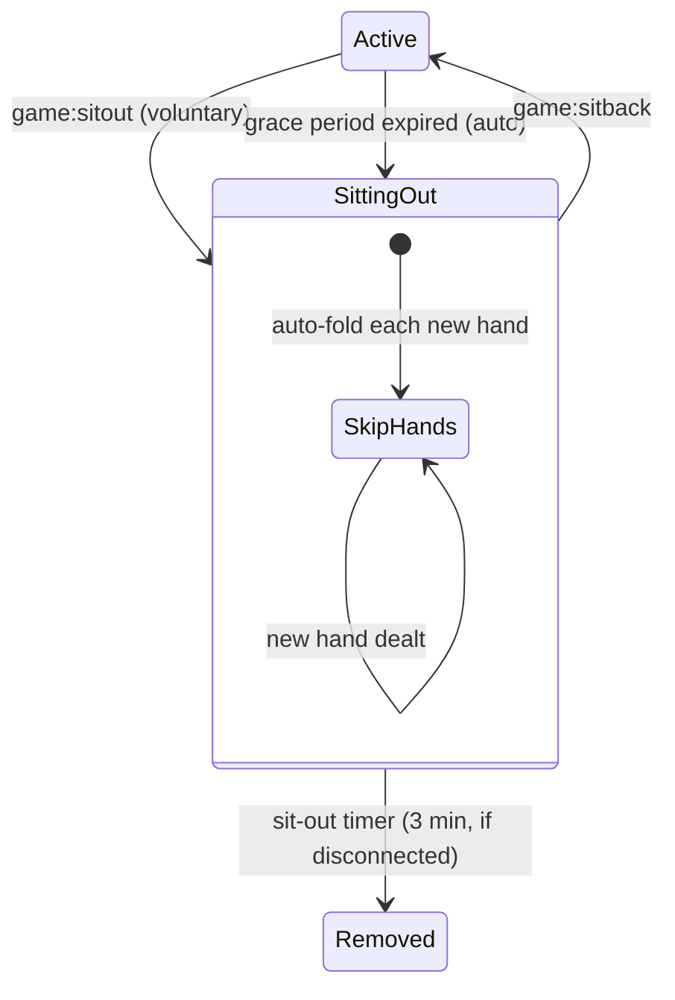

# Connection Resilience

Production-grade reconnection system inspired by PokerStars/GGPoker.

## Overview



## Heartbeat System

### How It Works

```
Client                          Server
  │                               │
  ├── heartbeat ──────────────────>│ recordHeartbeat(socketId)
  │                               │ quality = calculate(gap)
  │<──────────── heartbeat:ack ───┤ { quality, serverTime }
  │         (every 5 seconds)     │
  │                               │
  │   ╌╌╌ missed 3 heartbeats ╌╌╌│
  │                               │ softDisconnectTimer fires (15s)
  │                               │ → mark player "disconnected" at table
  │                               │ → broadcast updated state
  │                               │
  ├── heartbeat ──────────────────>│ cancel softDisconnectTimer
  │                               │ → unmark "disconnected"
  │<──────────── heartbeat:ack ───┤ quality: "stable"
```

### Timer Constants

| Constant | Value | Purpose |
|---|---|---|
| `HEARTBEAT_INTERVAL_MS` | 5,000 ms | Client ping frequency |
| `HEARTBEAT_TIMEOUT_MS` | 15,000 ms | 3 missed = soft disconnect |
| `HEARTBEAT_HARD_TIMEOUT_MS` | 90,000 ms | Consider fully disconnected |

### Connection Quality

| Quality | Condition | UI |
|---|---|---|
| `stable` | Gap < 12.5s between heartbeats | Green indicator |
| `unstable` | Gap 12.5s – 15s | Yellow indicator + pulsing glow + warning banner |
| `disconnected` | No heartbeat > 15s | Red indicator |

### Frontend Display

- **Header**: latency in ms (e.g. `42ms`) + colored indicator dot
- **Unstable banner**: "Unstable connection detected (Xms)" — yellow bar below header
- **Disconnected banner**: "Connection lost. Waiting to reconnect... (N actions queued)"

## Disconnect Grace Period

When a socket fully disconnects (not just missed heartbeats):



### Timer Constants

| Timer | Duration | Trigger | Action |
|---|---|---|---|
| Grace period | 60s | Socket disconnect | Auto-fold + sit out |
| Sit-out | 3 min | Grace period expired | Remove from table |
| Stale player cleanup | 10 min | Periodic | Purge from PlayerService |

## Persistent Identity

### Problem

Socket.IO assigns a new `socketId` on every connection. If we used `socketId` as player identity, reconnection would create a "new" player.

### Solution



**Frontend**: `userId` saved in `localStorage` key `poker_room_userId`. On socket `connect` event, if saved userId exists → emit `player:reconnect` instead of showing Login.

## Turn Timer & Auto-Actions

When it becomes a player's turn, a countdown starts:

| Player State | Timer Duration | On Timeout |
|---|---|---|
| Connected | 30 seconds | Auto-check if possible, else auto-fold |
| Disconnected | 15 seconds | Auto-check if possible, else auto-fold |



The timer info is included in `GameState.turnTimer`:

```typescript
{
  playerId: string;    // whose turn
  startedAt: number;   // Date.now() when started
  duration: number;    // ms (30000 or 15000)
}
```

Frontend `TurnTimerBar` renders an animated bar:
- **Green** → **Yellow** → **Red** as time decreases
- Shows seconds remaining

## Action Replay Queue

Handles actions sent while offline.



### Replay Validation Rules

| Check | Behavior |
|---|---|
| Action > 60s old | Skip as `expired` |
| Not player's turn | Reject as `invalid_action` |
| Wrong phase | Reject as `invalid_action` |
| After first failure | Skip remaining as `skipped_after_failure` |

### UI Feedback

- **Yellow banner** above action buttons: "N actions pending... (will replay on reconnect)"
- **Disconnected banner** in header: "Connection lost. Waiting to reconnect... (N actions queued)"

## Sitting Out

Players can voluntarily sit out or be auto-sat-out after grace period.



- Sitting-out players are **skipped** in dealer rotation
- Their cards are auto-folded each hand
- They keep their seat
- If disconnected + sitting out for 3 min → removed from table
- `game:sitback` cancels sit-out timer and restores active status

## Reconnect Overlay

Full-screen modal with:
- Spinner animation
- "Connection Lost" heading
- "Reconnecting... (attempt X)" — attempt count from Socket.IO
- "Your seat is reserved for 60 seconds" — reassurance

Shown when `reconnecting === true` (Socket.IO is attempting reconnection).
