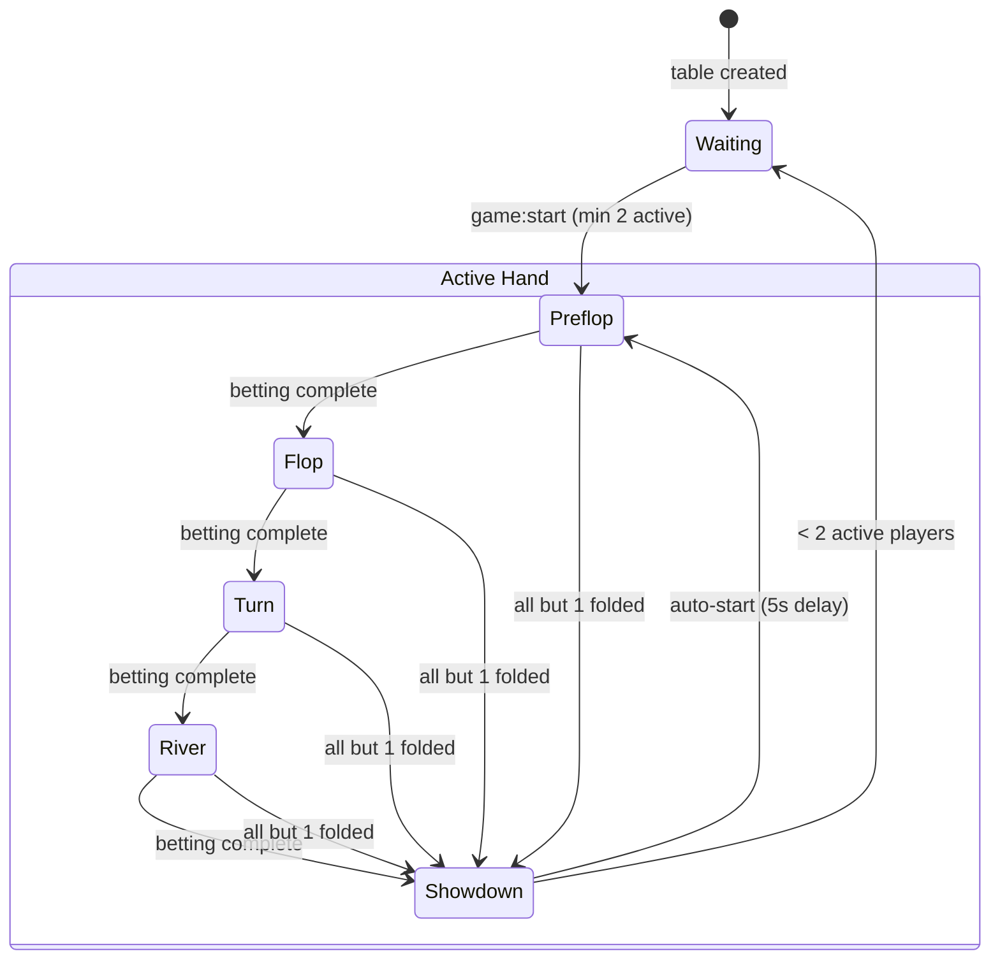
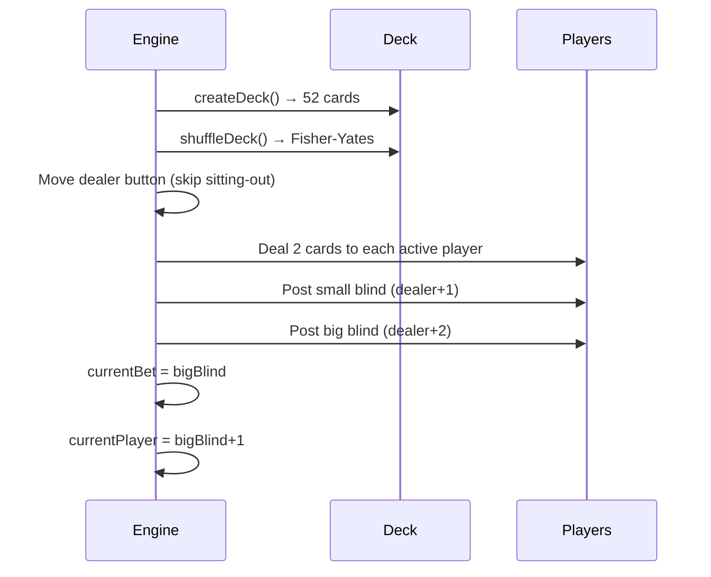
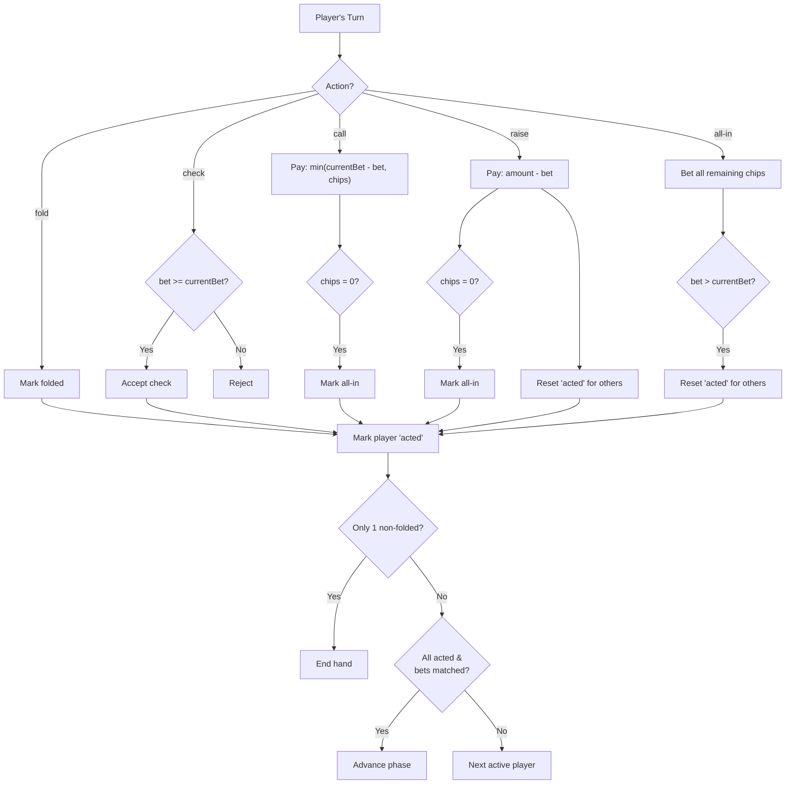

# Texas Hold'em Engine

The poker engine (`backend/src/game/poker-engine.ts`) implements full Texas Hold'em rules.

## Game Phases



### Phase Details

| Phase | Community Cards | Action |
|---|---|---|
| `waiting` | — | Players joining, game not started |
| `preflop` | 0 | 2 hole cards dealt, blinds posted, betting |
| `flop` | 3 | 3 community cards revealed, betting |
| `turn` | 4 | 4th card revealed, betting |
| `river` | 5 | 5th card revealed, betting |
| `showdown` | 5 | Hands evaluated, pot awarded |

## Deal & Blinds



- **Sitting-out players**: skipped for dealer, blinds, and dealing
- **All-in on blind**: if chips < blind amount, posts all remaining chips
- **Deck**: standard 52 cards, 4 suits × 13 ranks

## Betting Logic



### Round Completion

A betting round is complete when **all** non-folded, non-all-in players:
1. Have `acted === true`
2. Have `bet === currentBet`

A raise resets `acted = false` for all other active players.

## Hand Evaluation

Evaluates all C(7,5) = 21 five-card combinations from 7 available cards (2 hole + 5 community).

### Hand Rankings

| Rank | Hand | Score Base | Example |
|---:|---|---|---|
| 1 | Royal Flush | 9 × 10^10 | A K Q J 10 (same suit) |
| 2 | Straight Flush | 8 × 10^10 | 9 8 7 6 5 (same suit) |
| 3 | Four of a Kind | 7 × 10^10 | K K K K 3 |
| 4 | Full House | 6 × 10^10 | Q Q Q 7 7 |
| 5 | Flush | 5 × 10^10 | A J 8 4 2 (same suit) |
| 6 | Straight | 4 × 10^10 | 10 9 8 7 6 |
| 7 | Three of a Kind | 3 × 10^10 | 8 8 8 K 2 |
| 8 | Two Pair | 2 × 10^10 | J J 5 5 K |
| 9 | One Pair | 1 × 10^10 | A A 9 6 3 |
| 10 | High Card | 0 + kickers | A K J 8 3 |

### Scoring Formula

```
Score = handRank × 10^10 + kicker
kicker = Σ (cardValue × 15^(4-i))  for i = 0..4, sorted by count then value
```

Card values: 2=2, 3=3, ..., 10=10, J=11, Q=12, K=13, A=14

### Special Cases

- **Ace-low straight** (A-2-3-4-5): detected by checking `[14, 5, 4, 3, 2]`
- **Split pot**: equal scores → pot divided equally (floor division)
- **Winner by fold**: last remaining player wins pot, hand shown as "Last standing"

## Pot Management

- Each bet adds to `state.pot`
- At showdown, pot is awarded to winner(s)
- Split pot: `Math.floor(pot / numWinners)` per winner
- After showdown: `pot = 0`

## GameState Interface

```typescript
interface GameState {
  tableId: string;
  phase: 'waiting' | 'preflop' | 'flop' | 'turn' | 'river' | 'showdown';
  communityCards: Card[];        // 0-5 cards
  pot: number;
  players: PlayerSeat[];
  currentPlayerIndex: number;
  dealerIndex: number;
  smallBlind: number;
  bigBlind: number;
  currentBet: number;
  winners?: { playerId: string; amount: number; hand: string }[];
  turnTimer?: { playerId: string; startedAt: number; duration: number };
}

interface PlayerSeat {
  playerId: string;    // = userId
  name: string;
  chips: number;
  cards: Card[];       // empty [] if hidden
  bet: number;         // current round bet
  totalBet: number;    // total bet this hand
  folded: boolean;
  allIn: boolean;
  acted: boolean;
  disconnected: boolean;
  sittingOut: boolean;
}

interface Card {
  rank: '2' | '3' | ... | 'K' | 'A';
  suit: 'hearts' | 'diamonds' | 'clubs' | 'spades';
}
```
