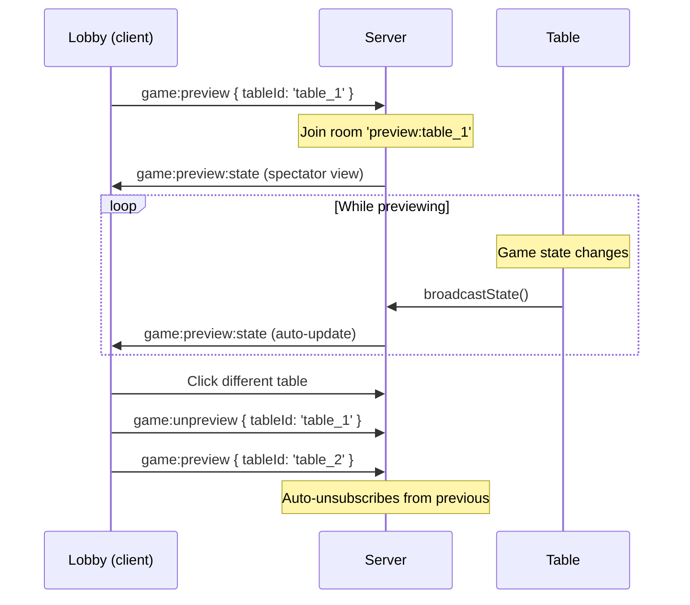
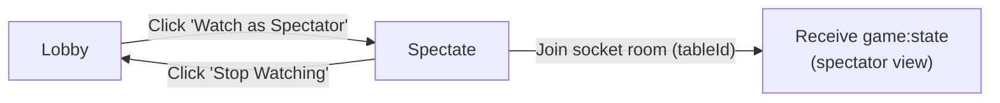
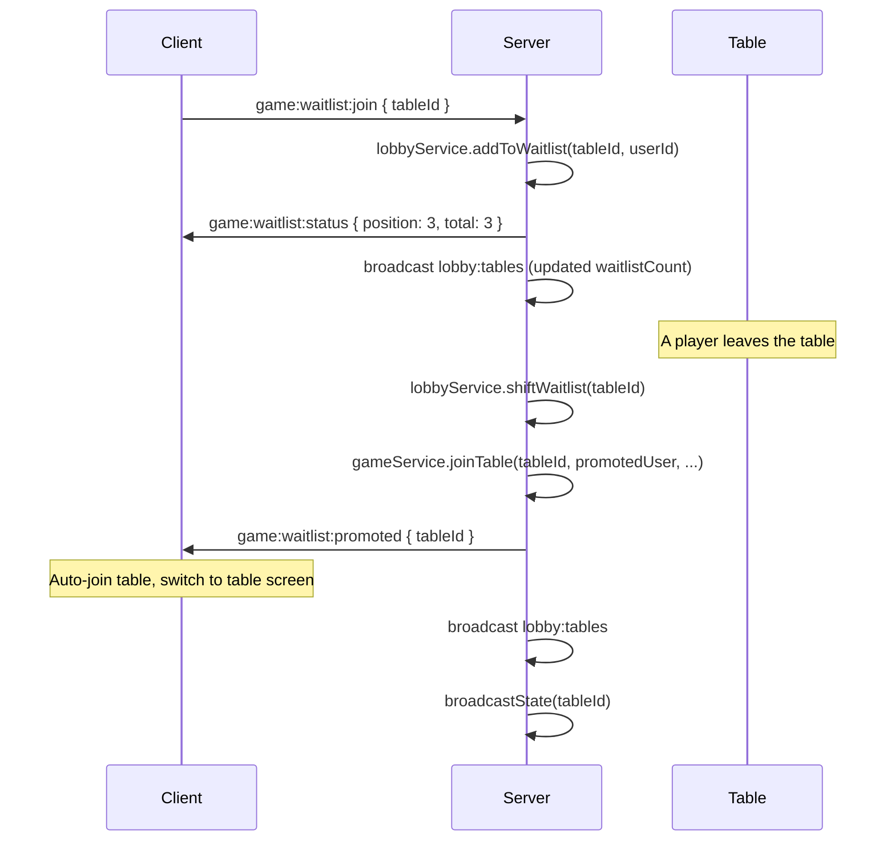
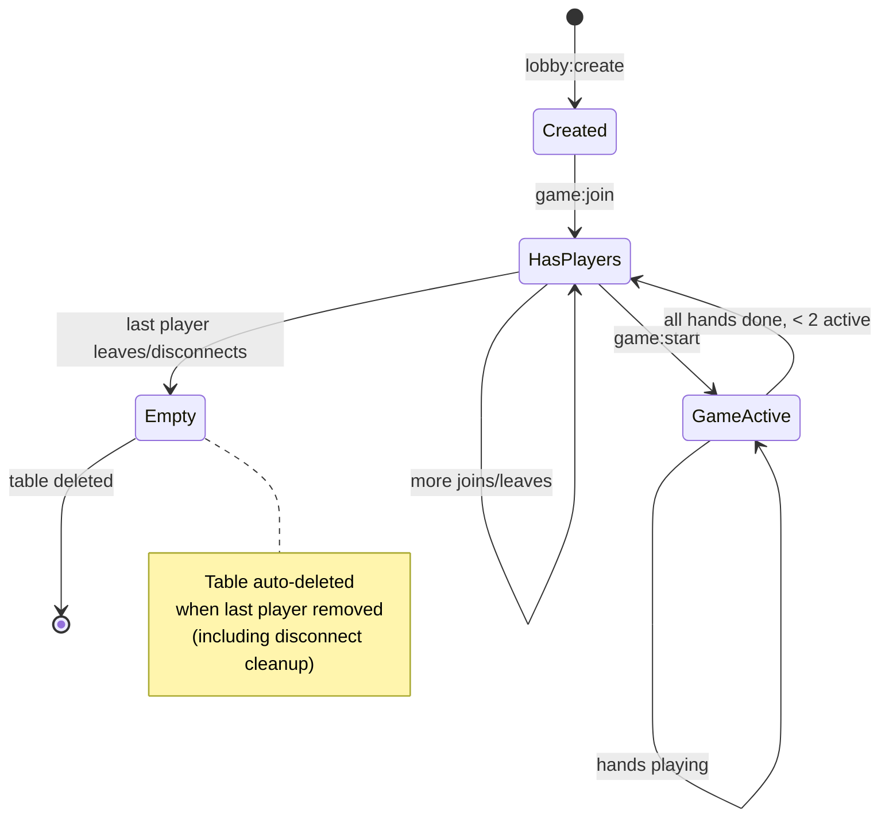

# Lobby, Spectators & Waitlist

## Lobby Layout

The lobby is a split-panel interface:

```
┌──────────────────────────────────────────────────────────────────┐
│ [Status: ▾] [Blinds: min─max] [☑ Has seats] [Sort: ▾] [↑↓]  + │
├───────────────────────┬──────────────────────────────────────────┤
│  Table List (35%)     │  Table Preview (65%)                     │
│                       │                                          │
│  ● Table 1  2/6  5/10│  ┌────────────────────────┐              │
│    Table 2  6/6 10/20│  │   Community Cards      │              │
│    Table 3  0/6  5/10│  └────────────────────────┘              │
│    Table 4  3/6 25/50│  Pot: 150                                │
│    ...                │  ┌──────┐ ┌──────┐ ┌──────┐             │
│                       │  │ P1   │ │ P2   │ │ P3   │             │
│                       │  └──────┘ └──────┘ └──────┘             │
│                       │                                          │
│                       │  [Join Table] [Watch as Spectator]       │
├───────────────────────┴──────────────────────────────────────────┤
```

## Table Filtering & Sorting

### Filters

| Filter | Type | Options |
|---|---|---|
| Phase | Dropdown | All / Waiting / Playing |
| Min blind | Number input | Filter tables with bigBlind >= value |
| Max blind | Number input | Filter tables with bigBlind <= value |
| Has seats | Checkbox | Only show tables with playerCount < maxPlayers |

### Sorting

| Sort by | Behavior |
|---|---|
| Name | Alphabetical table name |
| Players | By player count |
| Blinds | By big blind value |

Direction: toggle ascending/descending with arrow button.

## Preview System



When clicking a table in the list:
1. Unsubscribe from previous preview (if any)
2. Subscribe to new table's preview
3. Right panel shows live game state (readonly)
4. Action buttons appear at bottom

## Spectator Mode

Spectators watch a table full-screen (same UI as players, but without action buttons).



**Spectator view**:
- All players' hole cards hidden (shown as `?` backs)
- During showdown: all cards revealed
- No action buttons (fold/check/call/raise)
- "SPECTATOR" badge in top bar
- Phase, pot, community cards, player chips — all visible

**Preview vs Spectator**:

| | Preview (in Lobby) | Spectator (full screen) |
|---|---|---|
| Screen | Right panel of lobby | Full Table.tsx screen |
| Room | `preview:{tableId}` | `{tableId}` |
| Event | `game:preview:state` | `game:state` |
| Actions | Join / Watch / Waitlist buttons | Stop Watching button |
| View | Same spectator view | Same spectator view |

## The Rail — Spectator Display

In real poker, spectators watch from "the rail" — a barrier around the table. The app mirrors this:

```
┌──────────────────────────────────────────┐
│              Poker Table                  │
│    [Seat 1]  [Seat 2]  [Seat 3]         │
│                                          │
│    [Seat 6]  [Seat 5]  [Seat 4]         │
│                                          │
│  ┌──────────────────────────────────┐    │
│  │ 👁 The Rail  │ (A)(B)(C) +2  5 watching │
│  └──────────────────────────────────┘    │
└──────────────────────────────────────────┘
```

**How it works:**

- Server tracks spectator names via `GameGateway.getSpectatorList()`
- `broadcastState()` includes `spectators[]` array in every `game:state` payload
- Both seated players and spectators see "The Rail" panel

**Visual design:**
- Glass-panel bar at the bottom of the table area
- Eye icon + "The Rail" label
- Spectator avatars (first initial, up to 8 shown, then "+N")
- Tooltip on each avatar shows full name
- Counter: "N watching"

**Empty seats:**
- All 6 seat positions are always rendered
- Empty seats show a dashed-border placeholder with chair icon and "Seat N"
- 30% opacity to distinguish from occupied seats

**Data in GameState:**

```typescript
{
  ...gameState,
  spectators: [
    { name: "Alice", odId: "uuid-1" },
    { name: "Bob", odId: "uuid-2" }
  ],
  maxPlayers: 6
}
```

## Waitlist System

When a table is full (6/6 players), players can join a waitlist:



### Waitlist Rules

- **FIFO order**: first in, first out
- **Auto-promote**: when a seat opens, first person in waitlist is auto-seated
- **Disconnected skip**: if first person in waitlist is disconnected, try next
- **Cleanup**: player removed from all waitlists on disconnect
- **Display**: waitlist count shown in table list (`WL: 3`)

## Table Lifecycle



## TableInfo Interface

Sent in `lobby:tables` broadcasts:

```typescript
interface TableInfo {
  id: string;            // "table_1", "table_2", ...
  name: string;          // User-defined or auto "Table N"
  playerCount: number;   // Seated players
  maxPlayers: number;    // Always 6
  smallBlind: number;
  bigBlind: number;
  phase: string;         // Current game phase
  waitlistCount: number; // People in waitlist queue
}
```
