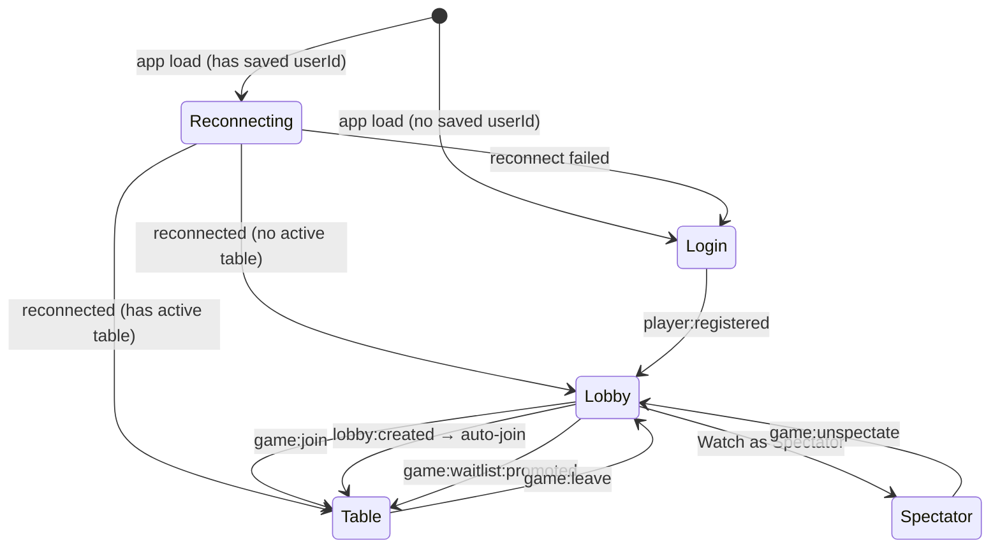
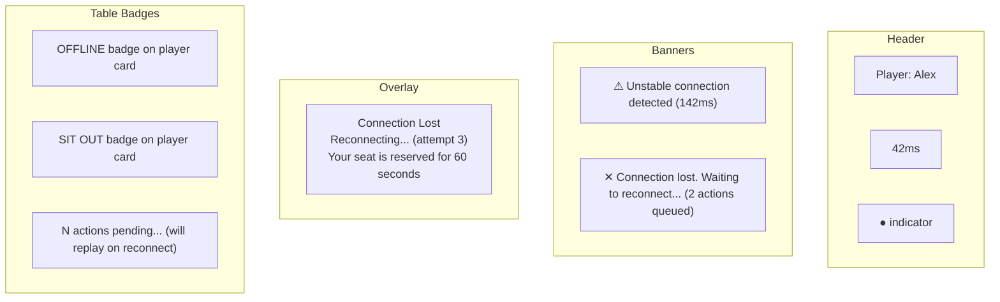

# Frontend Guide

## Screens



## Hooks

### `useSocket`

Manages Socket.IO connection with auto-reconnect.

```typescript
const { socket, connected, reconnecting, reconnectAttempt, saveUserId, clearUserId } = useSocket();
```

| Return | Type | Description |
|---|---|---|
| `socket` | `Socket \| null` | Socket.IO instance |
| `connected` | `boolean` | Currently connected |
| `reconnecting` | `boolean` | Socket.IO attempting reconnect |
| `reconnectAttempt` | `number` | Current attempt number |
| `saveUserId` | `(id) => void` | Persist to localStorage |
| `clearUserId` | `() => void` | Clear from localStorage |

**Reconnect strategy**:
- `reconnectionDelay`: 1000ms (initial)
- `reconnectionDelayMax`: 5000ms
- `reconnectionAttempts`: Infinity
- On connect: auto-emit `player:reconnect` if userId in localStorage

### `useHeartbeat`

Custom heartbeat ping/ack cycle.

```typescript
const { quality, latency } = useHeartbeat(socket, connected);
```

| Return | Type | Description |
|---|---|---|
| `quality` | `'stable' \| 'unstable' \| 'disconnected'` | Server-reported quality |
| `latency` | `number` | Round-trip time in ms |

Sends `heartbeat` every 5 seconds, measures RTT from `heartbeat:ack`.

### `useActionQueue`

Offline action buffering with replay.

```typescript
const { enqueueAction, clearQueue, pendingCount, hasPending } = useActionQueue(socket, connected, tableId);
```

| Return | Type | Description |
|---|---|---|
| `enqueueAction` | `(action, amount?) => void` | Send or buffer action |
| `clearQueue` | `() => void` | Clear pending actions |
| `pendingCount` | `number` | Actions awaiting ack |
| `hasPending` | `boolean` | Convenience flag |

**Behavior**:
- **Online**: sends `game:action` immediately, buffers until `game:action:ack`
- **Offline**: buffers with `seq` + `timestamp`
- **On reconnect**: sends `game:action:replay` with full buffer

## Components

### Login

Simple name input form. Emits `player:register`.

### Lobby

Split-panel layout:
- **Left (35%)**: `TableFilters` + scrollable `TableList`
- **Right (65%)**: `TablePreview` with live game state

Clicking a table subscribes to `game:preview` and shows real-time state. Create Table form inline.

### Table

Full game interface. Supports two modes via `spectator` prop:

| Feature | Player Mode | Spectator Mode |
|---|---|---|
| Action buttons | Yes (when your turn) | No |
| Own cards visible | Yes | No (all hidden) |
| "Start Game" button | Yes (waiting phase) | No |
| Sit Out / Sit Back | Yes | No |
| Leave button | "Leave Table" | "Stop Watching" |
| Badge | — | "SPECTATOR" |
| Pending actions | Shows yellow banner | — |

### CardView

Renders a single playing card:
- **Visible**: white background, rank + suit symbol, red for hearts/diamonds
- **Hidden**: gradient background with `?`
- **Suit symbols**: ♥ ♦ ♣ ♠

### TurnTimerBar

Animated countdown bar:
- Width decreases from 100% → 0% over timer duration
- Color transitions: green (#4ecca3) → yellow (#f0a500) → red (#e94560)
- Shows seconds remaining as text

### ReconnectOverlay

Full-screen modal (z-index: 1000):
- Semi-transparent black background
- Centered card with spinner, title, attempt count
- CSS `@keyframes spin` animation

### TableFilters

Filter controls: phase dropdown, blind range inputs, has-seats checkbox, sort dropdown + direction toggle.

### TableList

Vertical list of tables with:
- Selected highlight (blue background + red left border)
- Phase badge (green "Waiting" / red "Playing")
- Player count with color (green = has seats, red = full)
- Waitlist count (yellow `WL: N`)

### TablePreview

Readonly table view in lobby right panel:
- Table name, player count, blinds, phase
- Community cards (using CardView)
- Player grid with cards, chips, status
- Winner display during showdown
- Action buttons: Join Table / Watch as Spectator / Join Waitlist / Leave Waitlist

## Connection State UI



| State | Indicator | Banner | Overlay | Table |
|---|---|---|---|---|
| Stable | Green dot | — | — | — |
| Unstable | Yellow dot (glow) | Yellow warning | — | — |
| Disconnected | Red dot | Red warning + queue count | — | OFFLINE badge |
| Reconnecting | Red dot | — | Full overlay | OFFLINE badge |
| Sitting out | — | — | — | SIT OUT badge |
