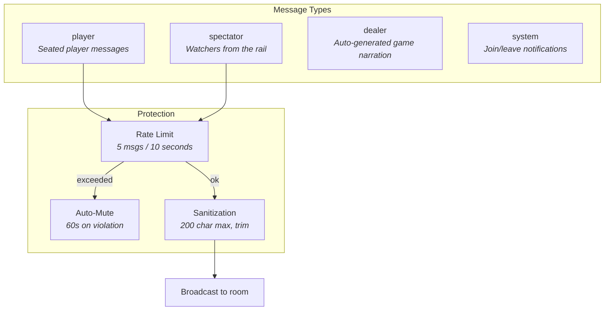
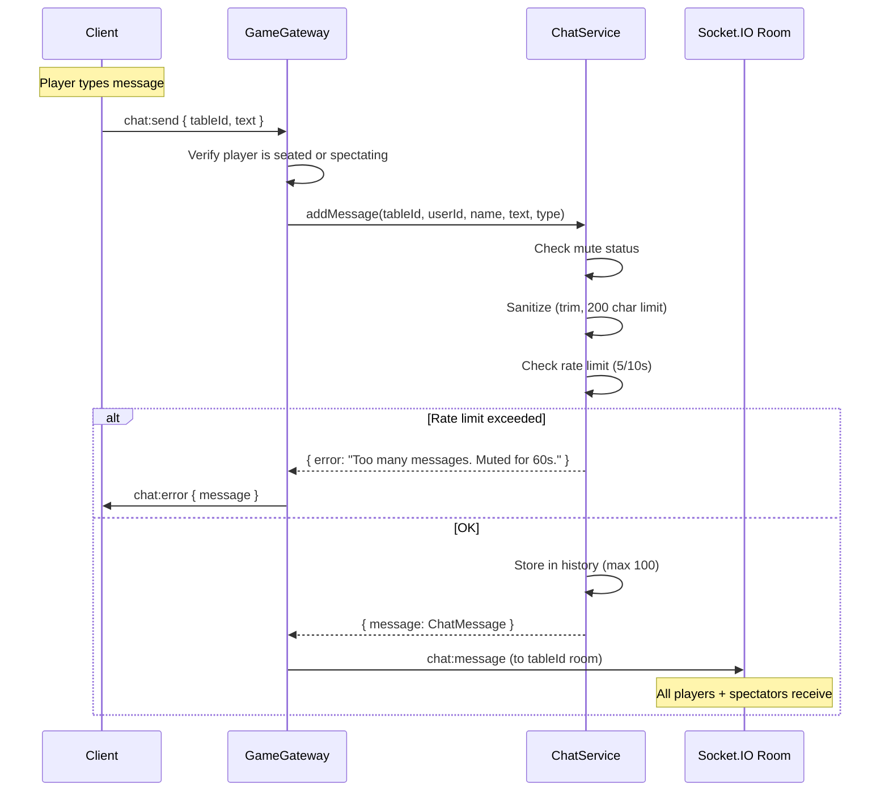
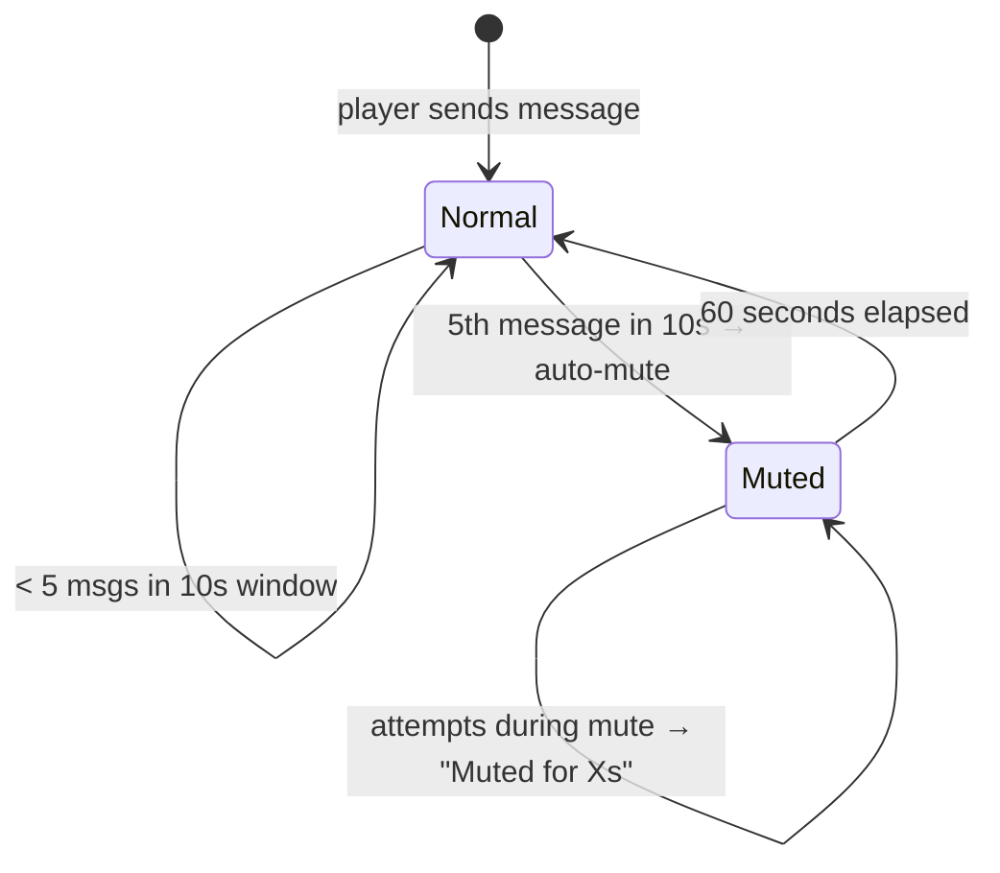
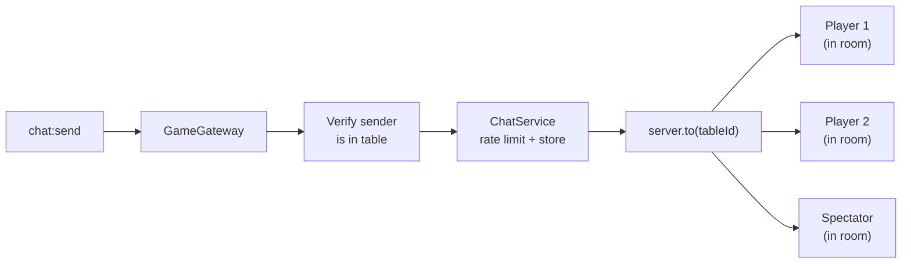

# Chat System

Production-ready table chat with dealer narration, rate limiting, and spam protection.

## Overview



## Architecture



## WebSocket Events

| Event | Direction | Payload | Description |
|---|---|---|---|
| `chat:send` | C → S | `{ tableId, text }` | Send a message |
| `chat:message` | S → Room | `ChatMessage` | New message broadcast |
| `chat:history` | C → S | `{ tableId }` | Request message history |
| `chat:history` | S → C | `{ tableId, messages[] }` | Last 100 messages |
| `chat:error` | S → C | `{ message }` | Rate limit / mute error |

## Message Types

### Player Messages
Sent by seated players. Displayed with white text and player name.

### Spectator Messages
Sent by watchers. Displayed with gray text, name, and "(spectator)" label.

### Dealer Messages (Auto-Generated)
Green text with playing card icon. Generated automatically on:

| Game Event | Dealer Message |
|---|---|
| Hand started | `Hand started. Small Blind: $5, Big Blind: $10` |
| Player folds | `Alex folds` |
| Player checks | `Alex checks` |
| Player calls | `Alex calls` |
| Player raises | `Alex raises to $50` |
| Player all-in | `Alex goes all-in` |
| Flop dealt | `--- Flop ---` |
| Turn dealt | `--- Turn ---` |
| River dealt | `--- River ---` |
| Winner | `Alex wins $100 with Full House` |

### System Messages
Centered, muted text. Generated on:

| Event | System Message |
|---|---|
| Player joins table | `Alex joined the table` |
| Player leaves table | `Alex left the table` |

## ChatMessage Interface

```typescript
interface ChatMessage {
  id: string;           // "msg_1", "msg_2", ...
  tableId: string;
  userId: string;       // "__system__" for dealer/system
  name: string;         // Player name, "Dealer", or "System"
  text: string;
  type: 'player' | 'spectator' | 'system' | 'dealer';
  timestamp: number;    // Date.now()
}
```

## Rate Limiting & Spam Protection



| Rule | Value |
|---|---|
| Rate limit window | 10 seconds |
| Max messages per window | 5 |
| Mute duration on violation | 60 seconds |
| Max message length | 200 characters |
| Max history per table | 100 messages |

**Behavior:**
- Messages are trimmed and capped at 200 characters
- Empty messages are rejected
- Sliding window rate limit: tracks timestamps of last N messages
- On 6th message within 10s → `chat:error` with mute notification
- During mute, all `chat:send` attempts return remaining mute time
- Mute expires automatically after 60 seconds

## Frontend Component

### ChatPanel (`frontend/src/components/ChatPanel.tsx`)

```
┌─────────────────────────┐
│ 💬 TABLE CHAT      [✕]  │  ← Header with toggle
├─────────────────────────┤
│                         │
│ Alex joined the table   │  ← System (centered, muted)
│                         │
│ 🃏 Hand started. SB...  │  ← Dealer (green + card icon)
│                         │
│ Alex              02:43 │  ← Player (white, timestamp on hover)
│ nice hand               │
│                         │
│ Bob (spectator)   02:43 │  ← Spectator (gray + label)
│ gl everyone             │
│                         │
│ ⚠ Too many messages...  │  ← Error (red bar, auto-dismiss 3s)
├─────────────────────────┤
│ [Type a message...] [→] │  ← Input + send button
└─────────────────────────┘
```

**Props:**
```typescript
interface ChatPanelProps {
  socket: Socket;
  tableId: string;
  playerId: string;
  collapsed?: boolean;   // Show as floating icon
  onToggle?: () => void; // Toggle collapsed state
}
```

**Features:**
- Glass-panel styling (backdrop-blur, semi-transparent)
- 320px width, right side of table
- Auto-scroll to latest messages
- Enter key to send
- Timestamps shown on hover (HH:MM format)
- Collapsed mode: floating chat icon button (bottom-right)
- Toggle via button in table top bar (desktop) or floating icon (mobile)
- Error bar for rate limit notifications (auto-dismiss after 3s)
- Chat history loaded on component mount via `chat:history`

**Message Styling:**

| Type | Name Color | Text Color | Extra |
|---|---|---|---|
| `player` (self) | Green (primary) | White | — |
| `player` (other) | White | White | — |
| `spectator` | Gray | Gray | "(spectator)" label |
| `dealer` | Green | Green/80 | Playing card icon |
| `system` | — | Muted/50 | Centered, uppercase |

## Delivery Architecture

Chat uses Socket.IO rooms for efficient delivery:



All seated players join room `tableId` on `game:join`. Spectators join on `game:spectate`. A single `server.to(tableId).emit()` reaches everyone — no duplicate per-socket delivery needed.

## Storage

- In-memory `Map<tableId, ChatMessage[]>` in ChatService
- Max 100 messages per table (oldest trimmed on overflow)
- Table chat cleared when table is deleted (all players leave)
- Rate limit timestamps stored per userId
- Mute state stored per userId with expiry timestamp
- All state lost on server restart (PoC scope)
